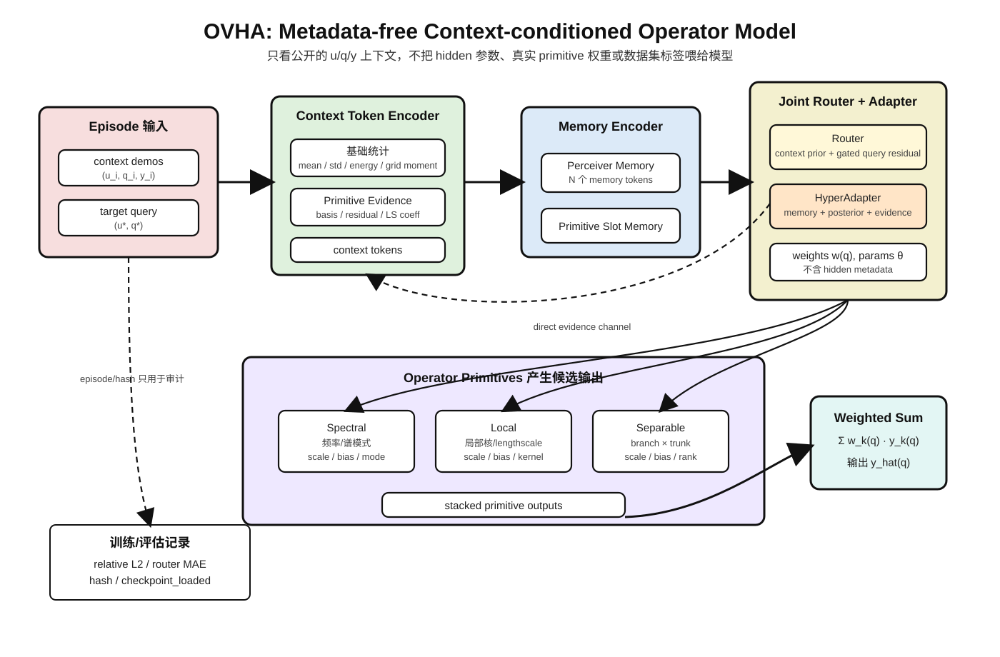
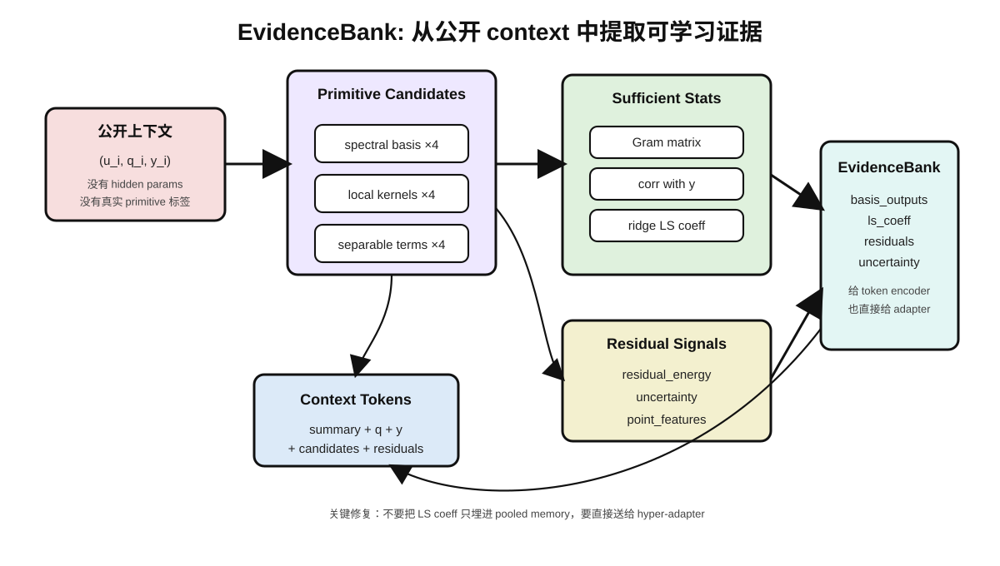
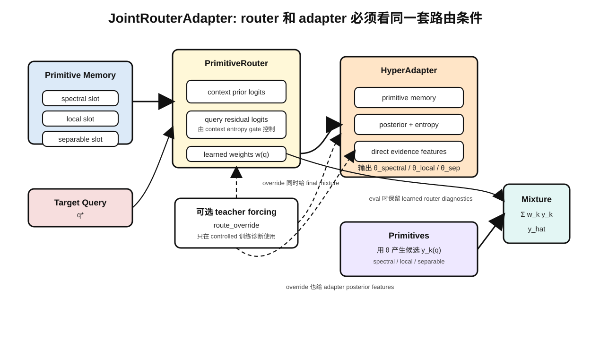
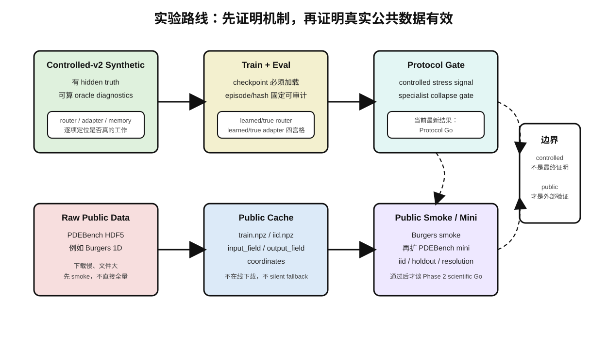

# OVHA 项目从零说明：原理、代码实现、实验进展与公共数据集计划

更新时间：2026-05-29
面向读者：第一次看这个项目、不了解神经算子/OVHA 细节的人

---

## 0. 长期总目标：不要把 OVHA 收缩成某个 benchmark 项目

项目长期目标见独立文档：

```text
docs/ovha_project_objective_zh.md
```

必须先明确一点：OVHA 不是 PDEBench-only、PINN-only、FNO-only、DeepONet-only 或电磁仿真专用项目。PDEBench、DeepONet、FNO、PINN、物理场、电磁仿真、CV 等都只是阶段性验证场景或解释例子，不是研究边界。

OVHA 的核心目标是形成一种面向多模态/跨模态泛化的通用 operator-valued attention 框架：

- 理论核心：**Operator-Valued Attention**
- 实现框架：**Hyper-Operator Transformer**
- 上下文机制：**Operator Memory Transformer**
- 关键机制：**primitive routing**、**operator-specific memory**、**hyper-adapter 参数生成**、**可解释 operator decomposition**

所以后文提到 PDEBench、controlled-v2、Burgers、DeepONet/FNO/PINN 对比时，都应理解为“验证场景”，不是项目最终定义。当前阶段先用 controlled-v2 证明机制，再用 PDEBench smoke/mini 做外部验证；最终目标是迁移到连续场、图像、文本、音频、跨模态 token 等不同数据形态。

---

## 1. 这个项目到底想做什么

这个项目的目标不是简单训练一个普通神经网络，而是训练一个“看几个示例就能理解当前算子”的模型。

可以把一个算子理解成一个函数到函数的映射：

```text
输入函数 u(x)  ->  输出函数 y(q)
```

例如 PDEBench 里的 Burgers 方程数据，可以粗略理解成：

```text
初始状态 u(x)  ->  未来某个时刻的解 y(q)
```

模型在每个 episode 里会看到一些上下文示例：

```text
context = 多组 (u_i, q_i, y_i)
target  = 一个新的 u* 和一批查询点 q*
目标    = 预测 y*(q*)
```

这里最关键的是：模型不能直接吃隐藏标签。比如不能把“这是 Burgers 方程”“这个样本的真实参数是多少”“真实 primitive 权重是多少”直接喂给模型。模型只能看公开可见的数值场：

- `u`：输入场或条件场
- `q`：查询坐标
- `y`：上下文里已经观测到的输出值

这就是项目里一直强调的 `metadata-free`：不靠人工标签作弊，而是靠上下文示例自己推断当前算子的结构。

---

## 2. OVHA 的核心想法，用小白能懂的话说

OVHA 全称可以理解成 Operator-Valued Hyper-Attention。它的核心思想是：

> 不要让一个黑盒模型硬背所有算子，而是先准备几个可解释的“算子组件”，再让模型根据上下文判断该用哪些组件、每个组件的参数是多少。

当前 controlled-v2 里主要有三个 primitive：

| Primitive | 直观含义 | 代码位置 |
|---|---|---|
| `spectral` | 用频率/谱基函数描述的全局模式 | `moat_ovha_torch/models/primitives/` |
| `local` | 类似局部卷积/局部核的行为 | `moat_ovha_torch/models/primitives/` |
| `separable` | 分离变量形式，branch 与 trunk 相乘组合 | `moat_ovha_torch/models/primitives/` |

模型做预测时，不是只输出一个答案，而是：

1. 每个 primitive 都给一个候选输出。
2. router 给每个 primitive 一个权重。
3. hyper-adapter 给每个 primitive 推断参数，比如 scale、bias、lengthscale、rank logits 等。
4. 最终预测是几个 primitive 输出的加权和。

简化公式：

```text
y_hat(q) =
  w_spectral(q)  * spectral(u, q; theta_spectral)
+ w_local(q)     * local(u, q; theta_local)
+ w_separable(q) * separable(u, q; theta_separable)
```

其中：

- `w_*` 由 router 从上下文和 query 推断。
- `theta_*` 由 hyper-adapter 从上下文证据和 memory 推断。
- 每个 primitive 的具体计算由 primitive 模块完成。

### 2.1 先看图：一张总图和三张局部图

下面这几张图按论文架构图的方式画：白底、黑色箭头、浅色模块框。建议先看总图，再看三个局部图。

图 1 是完整 OVHA forward，从 episode 输入一直到 `y_hat` 输出：



图 2 解释 `EvidenceBank`：为什么模型能只从公开 `(u, q, y)` 里提取 spectral/local/separable 证据，而不需要 hidden metadata：



图 3 解释 router 和 hyper-adapter 的耦合：训练时如果有 `route_override`，它必须同时影响最终 mixture 和 adapter posterior features；评估时仍保留 learned router 作为诊断：



图 4 解释实验路线：controlled-v2 先证明机制，public benchmark 再证明外部有效性：



---

## 3. 从数据到预测，代码如何落实这个想法

### 3.1 Episode 数据结构

模型训练和评估都围绕 `MetaOperatorBatch` 进行。它包含：

| 字段 | 含义 |
|---|---|
| `context_u` | 上下文示例的输入场 |
| `context_q` | 上下文示例的查询点 |
| `context_y` | 上下文示例在查询点上的真实输出 |
| `target_u` | 要预测的新输入场 |
| `target_q` | 要预测的新查询点 |
| `target_y` | 训练/评估时用于算 loss 的真实答案 |
| `support_grid` | 输入场所在的网格 |
| `context_mask` / `target_mask` | 有效点 mask |

相关代码：

```text
moat_ovha_torch/data/episodes.py
moat_ovha_torch/data/operator_zoo_torch.py
moat_ovha_torch/data/public_episode_source.py
```

### 3.2 数据来源：synthetic 或 public

训练入口会调用：

```text
build_episode_source(config, seed)
```

代码位置：

```text
moat_ovha_torch/data/public_episode_source.py
```

它会根据配置选择两种来源之一：

| 来源 | 类 | 用途 |
|---|---|---|
| synthetic controlled-v2 | `SyntheticEpisodeSource` | 机制诊断，知道隐藏真值，可验证 router/adapter/memory 是否真的学对 |
| public benchmark cache | `PublicBenchmarkEpisodeSource` | 真实公开数据，验证外部有效性 |

如果配置里有 public family，比如 `pdebench_burgers_1d`，并且配置了 `public_data_root` 或环境变量 `OVHA_PUBLIC_BENCHMARK_ROOT`，就会走公共数据路径。否则走 synthetic 生成器。

### 3.3 ContextTokenEncoder：把上下文变成 token

代码位置：

```text
moat_ovha_torch/models/context_encoder.py
```

它做两件事：

1. 从上下文 `(u, q, y)` 直接构造基础统计特征：
   - `u_mean`
   - `u_std`
   - `u_energy`
   - `u_grid_moment`
   - `q`
   - `y`

2. 调用 `PrimitiveEvidenceEncoder` 计算 primitive 对齐证据。

核心入口：

```python
tokens, evidence_bank = self.context_encoder.encode_with_evidence(batch)
```

### 3.4 EvidenceBank：把“公开上下文”转成可用证据

代码位置：

```text
moat_ovha_torch/models/evidence.py
```

`EvidenceBank` 不是隐藏标签，它只从公开上下文 `(u, q, y)` 计算出来。它包含：

| 字段 | 含义 |
|---|---|
| `basis_outputs` | 每个 primitive 的候选基函数输出 |
| `residuals` | 真实上下文 y 和候选输出的残差 |
| `gram` | 候选基之间的 Gram 矩阵 |
| `corr` | 候选基和真实 y 的相关 |
| `ls_coeff` | 岭回归最小二乘系数 |
| `residual_energy` | 残差能量 |
| `uncertainty` | 残差不确定性 |
| `point_features` | 展开到每个 context 点的证据特征 |

这里非常重要：之前实验失败的一个核心原因，就是 evidence 已经算出了很有用的最小二乘系数，但 adapter 没有直接看到它，信息被 memory pooling 压扁了。后续修复把这些证据直接送进 hyper-adapter。

### 3.5 Memory：从上下文 token 形成可读记忆

代码位置：

```text
moat_ovha_torch/models/memory.py
```

当前 OVHA 使用：

- `PerceiverMemoryEncoder`
- `PrimitiveSlotMemoryEncoder`

流程是：

```text
context tokens
  -> perceiver memory
  -> primitive-specific memory bank
```

每个 primitive 会拿到自己的 memory slot，避免所有 primitive 只读同一个平均池化结果。

### 3.6 Router：判断每个 query 应该用哪些 primitive

代码位置：

```text
moat_ovha_torch/models/router.py
```

router 输出：

```python
RouterOutput(
    weights,
    logits,
    context_prior_logits,
    query_residual_logits,
)
```

它分两层：

1. `context_prior_logits`：从整段上下文判断当前 episode 更像哪个 primitive。
2. `query_residual_logits`：如果任务确实需要 query-level 切换，再按 query 点微调 routing。

后来发现 query residual 在单 primitive episode 上会引入无意义扰动，所以现在做了 context entropy gate：

```text
如果 context prior 已经很确定，就压低 query residual。
如果 context prior 不确定，才允许 query-conditioned router 发挥作用。
```

这就是 `controlled_v2_sanity_context_gated_gpu4` 最终能过 gate 的关键修复之一。

### 3.7 HyperAdapter：给 primitive 推断参数

代码位置：

```text
moat_ovha_torch/models/hyper_adapter.py
```

它输入：

- primitive memory
- router posterior
- router entropy
- direct evidence features
- target query

然后输出每个 primitive 的参数：

```python
PrimitiveParams(
    scale=...,
    bias=...,
    local_lengthscale=...,
    spectral_mode_logits=...,
    separable_rank_logits=...,
)
```

关键修复：

1. adapter 直接读取 `ls_coeff`、`residual_energy`、`uncertainty`。
2. local primitive 有一个仅限 `model_aligned` controlled-v2 的公开证据 lengthscale prior。
3. 这个 prior 做了 amplitude normalization，并由 local router posterior gate 控制强度，避免在混合任务里无脑注入。

### 3.8 OVHAMetaOperator.forward：完整前向流程

代码位置：

```text
moat_ovha_torch/models/ovha.py
```

核心流程：

```text
batch
  -> ContextTokenEncoder.encode_with_evidence
  -> MemoryEncoder
  -> PrimitiveSlotMemoryEncoder
  -> JointRouterAdapter
       -> PrimitiveRouter
       -> HyperAdapter
  -> 每个 primitive 产生候选输出
  -> router weights 加权求和
  -> y_hat
```

对应代码结构：

```python
tokens, evidence_bank = self.context_encoder.encode_with_evidence(batch)
memory = self.memory_encoder(tokens, batch.context_mask)
memory_bank = self.primitive_slot_memory(memory)
router_out, params = self.joint_router_adapter(...)
weights = _prepare_weights(router_out.weights, route_override, active_primitive_mask)
primitive_outputs = [...]
y_hat = (weights.unsqueeze(-1) * stacked).sum(dim=-2)
```

### 3.9 JointRouterAdapter：router 和 adapter 必须看同一种 teacher route

代码位置：

```text
moat_ovha_torch/models/joint_router_adapter.py
```

之前有一个重要问题：训练时 final mixture 用了 oracle route override，但 adapter 看到的还是 learned router posterior。这会让 adapter 学到不一致的条件。

现在修复为：

```python
adapter_router_out = _adapter_router_output(router_out, route_override)
params = self.hyper_adapter(..., router_out=adapter_router_out)
```

意思是：

- 训练时如果 teacher forcing 说“这是 local”，最终 mixture 用 local。
- adapter 也必须知道“现在按 local 来学”。
- 但 diagnostics 仍保留 learned router 输出，方便检查 router 自己有没有学会。

---

## 4. 训练流程：loss 是怎么组合的

训练入口：

```text
moat_ovha_torch/train/trainer.py
train_torch_meta_operator.py
```

每一步训练做：

1. 按配置选一个 family。
2. 用 episode source 采样 batch。
3. controlled synthetic 时，可以根据 hidden truth 构造 oracle route override。
4. 模型 forward 得到 `y_hat`、router 输出、adapter 参数、diagnostics。
5. 计算多个 loss。
6. 反向传播、更新参数。
7. 写 JSONL metrics 和 checkpoint。

当前 controlled-v2 sanity 的关键 loss 权重：

```json
{
  "prediction_loss_weight": 1.0,
  "router_auxiliary_loss_weight": 0.25,
  "adapter_auxiliary_loss_weight": 0.4,
  "primitive_output_loss_weight": 0.4,
  "oracle_routed_prediction_loss_weight": 0.4,
  "param_scope_loss_weight": 0.05,
  "router_query_residual_loss_weight": 0.01
}
```

为什么不是一味提高 adapter loss？

之前确实发现 adapter 权重太低时，adapter 参数推断不够强，尤其 separable/local 会输给 specialist。于是提高过 adapter 权重。但后来又发现如果 adapter 权重提高太多，例如 0.75 左右，router CE 在总 loss 里占比太小，router 会被“饿死”，separable 的 learned router 退化明显。

所以最后不是“adapter 高就好”或“router 高就好”，而是平衡：

- adapter 从 0.2 提到 0.4：解决 adapter 学不到参数的问题。
- router CE 从 0.05 提到 0.25：避免 router 被 adapter 辅助项压住。
- query residual 加 0.01 正则，并由 context entropy gate 控制：避免单 primitive episode 被 query router 扰乱。

这套权重在 `controlled_v2_sanity_context_gated_gpu4` 里通过了 controlled protocol gate。

---

## 5. 评估流程：为什么有 learned/true router 和 learned/true adapter 四宫格

评估入口：

```text
moat_ovha_torch/eval/evaluator.py
eval_torch_meta_operator.py
scripts/summarize_phase1_6.py
```

评估时默认不使用 oracle route override，模型必须自己从上下文推断。评估会写：

- `relative_l2`
- `mse`
- `primitive_entropy`
- `memory_swap_delta`
- checkpoint 是否真的 loaded
- `episode_id`
- `batch_hash`
- `context_hash`
- `target_hash`

controlled synthetic 还有额外 oracle diagnostics：

| 指标 | 含义 |
|---|---|
| learned router + learned adapter | 模型真实推理效果 |
| true router + learned adapter | 如果路由完美，adapter 还差多少 |
| learned router + true adapter | 如果 adapter 完美，router 还差多少 |
| true router + true adapter | primitive/generator 是否本身能表达真值 |

这个四宫格非常关键。它能判断失败来自哪里：

| 现象 | 说明 |
|---|---|
| true/true 也差 | primitive 和数据生成器不匹配 |
| true router 好，learned router 差 | router 学坏了 |
| true adapter 好，learned adapter 差 | adapter 推参能力不够 |
| no-memory 也好 | context memory 没提供必要信息 |

---

## 6. 从失败到通过：已经完成的关键实验

### 6.1 第一阶段：controlled-v2 sanity 最初是 No-Go

早期 `controlled_v2_sanity_aux_activity_fix` 跑完后，summary 给出：

```text
Scientific No-Go:
checkpoint path is wired, but OVHA-full does not beat controlled-stress baselines/ablations.
```

当时主要问题：

- `single_primitive_local`：full 比 matched specialist 差。
- `single_primitive_separable`：full 比 matched specialist 差。
- router/adaptor/memory 的贡献信号不够干净。

代表性结果：

| family | ovha_full | matched_single | 结论 |
|---|---:|---:|---|
| context_identifiable_mixture | 0.236023 | - | provisional component signal |
| query_piecewise_router | 0.724272 | - | provisional component signal |
| single_primitive_local | 0.132196 | 0.112896 | negative component signal |
| single_primitive_separable | 0.381443 | 0.330983 | negative component signal |
| single_primitive_spectral | 0.309901 | 0.332570 | provisional component signal |

这说明架构大方向不是完全错，但 local/separable 的 adapter collapse 没过。

### 6.2 Opus 第一轮 review 后修复的问题

第一轮严格 review 指出几个关键问题：

1. `router_ce` 用了 post-override weights，导致 oracle-routed batch 上 router 没梯度。
2. adapter 没有直接读取 evidence 里的 least-squares coefficients。
3. G1 gate 和 5k sanity 训练制度不同，adapter 权重和 shared training 干扰要统一分析。
4. single primitive gate 不应该要求 full 严格小于 specialist，而应使用 collapse tolerance。
5. active primitive mask 用 `> 0.5` 有潜在 bug。
6. adapter scale/bias 范围原来太窄，对 parameter_holdout 不够。

这些已经在代码里修掉：

| 修复 | 代码位置 |
|---|---|
| router CE 从 learned router output 算 | `moat_ovha_torch/train/trainer.py` |
| route override 同时传给 adapter | `moat_ovha_torch/models/joint_router_adapter.py` |
| adapter 直接读取 evidence | `moat_ovha_torch/models/hyper_adapter.py` |
| single primitive gate 用 tolerance | `scripts/summarize_phase1_6.py` |
| active mask 改为适配非 one-hot | `moat_ovha_torch/train/trainer.py` |
| adapter scale/bias 范围放宽 | `moat_ovha_torch/models/hyper_adapter.py` |

### 6.3 第二阶段：adapter 修好了，但 router 又暴露问题

`controlled_v2_sanity_opus_fix` 仍然 No-Go。表面看 local 还没过，但更重要的是 separable 的 learned router 出现明显回退：

| view | separable relative L2 |
|---|---:|
| learned router + learned adapter (`ovha_full`) | 0.501600 |
| true router + learned adapter | 0.361754 |
| matched_single | 0.358387 |

这说明：

```text
separable adapter 基本已经会了；
真正把 separable 拉坏的是 learned router。
```

同时 `ovha_no_query_router = 0.440458` 比 full 的 0.501600 更好，说明 query-conditioned router residual 对 separable 单 primitive episode 注入了噪声。

### 6.4 第三阶段：重新平衡 router/adaptor 权重

之后跑了 `controlled_v2_sanity_router_rebalance_gpu4`：

| family | ovha_full | matched_single | 结论 |
|---|---:|---:|---|
| context_identifiable_mixture | 0.233777 | - | provisional component signal |
| query_piecewise_router | 0.410028 | - | provisional component signal |
| single_primitive_local | 0.125801 | 0.103039 | negative component signal |
| single_primitive_separable | 0.377223 | 0.334966 | provisional component signal |
| single_primitive_spectral | 0.288247 | 0.299238 | provisional component signal |

这一版 separable learned router 明显恢复：

```text
single_primitive_separable router_true_weight_mae:
ovha_full = 0.013490
```

但 local gate 仍差一点：

```text
local full_true_router_learned_adapter = 0.123053
matched_single = 0.103039
threshold = 0.118191
passed = False
```

差距很小，但 protocol 仍然是 No-Go。

### 6.5 第四阶段：context-gated query router 后通过 controlled protocol

最终 `controlled_v2_sanity_context_gated_gpu4` 通过：

```text
Protocol Go with provisional controlled-stress signal:
checkpoint path is wired; public benchmark evidence is still required before Phase 2 scientific Go.
```

最终 controlled stress 表：

| family | ovha_full | matched_single | vector_big | no_memory | no_router | no_adapter | 结论 |
|---|---:|---:|---:|---:|---:|---:|---|
| context_identifiable_mixture | 0.230910 | - | 0.378060 | 0.574313 | 0.244823 | 0.593551 | provisional component signal |
| query_piecewise_router | 0.422792 | - | 0.773527 | 0.817704 | 0.741467 | 0.696580 | provisional component signal |
| single_primitive_local | 0.113165 | 0.100267 | 0.502486 | 0.527392 | 0.102566 | 0.482135 | provisional component signal |
| single_primitive_separable | 0.378060 | 0.350048 | 0.946389 | 1.011983 | 0.452004 | 0.953849 | provisional component signal |
| single_primitive_spectral | 0.247044 | 0.304623 | 0.812707 | 0.972936 | 0.291419 | 0.892073 | provisional component signal |

Specialist Collapse Gate：

| family | full_true_router_learned_adapter | matched_single | threshold | passed |
|---|---:|---:|---:|---|
| single_primitive_local | 0.111140 | 0.100267 | 0.115280 | True |
| single_primitive_separable | 0.341804 | 0.350048 | 0.377550 | True |
| single_primitive_spectral | 0.248309 | 0.304623 | 0.329854 | True |

Router accuracy：

| family | ovha_full router_true_weight_mae |
|---|---:|
| context_identifiable_mixture | 0.112210 |
| query_piecewise_router | 0.124245 |
| single_primitive_local | 0.012391 |
| single_primitive_separable | 0.011539 |
| single_primitive_spectral | 0.049220 |

这说明当前 controlled-v2 gate 已经达到“可以进入公共数据集验证”的程度。

注意：这还不是 Phase 2 scientific Go。它只是说明：

```text
在可控合成任务里，router / memory / adapter / primitives 的机制已经基本跑通。
下一步必须用公开真实数据验证。
```

---

## 7. 公共数据集是用来干什么的

controlled synthetic 数据的优点是知道 hidden truth，所以特别适合定位问题：

- router 有没有学对？
- adapter 有没有学对参数？
- primitive 本身是不是能表达真值？
- memory 有没有贡献？

但它也有明显局限：

```text
它是我们自己设计的数据生成器。
模型在 synthetic 上通过，不等于在真实公开 benchmark 上也有用。
```

公共数据集的作用是外部验证：

1. 数据不是我们自己生成的 controlled toy。
2. 没有 hidden primitive 权重、没有 true adapter 参数。
3. 模型只能靠真实 field pairs 构造 episode。
4. 最终看 OVHA 是否比 `transformer_only`、`simple_stack` 等 baseline 更好。

当前第一步公共数据是 PDEBench 的 Burgers 1D：

```text
1D_Burgers_Sols_Nu0.01.hdf5
```

它不是最终完整 benchmark，只是 public smoke。

### 7.1 为什么先跑 smoke

因为公共路径刚接上，先要确认：

- 原始 HDF5 能下载。
- 能转成项目需要的 `.npz` cache。
- `PublicBenchmarkEpisodeSource` 能读 cache。
- train/eval JSONL 里 `dataset`、`source_split`、`public_benchmark` 正确写入。
- checkpoint 能保存和加载。
- GPU 训练流程能跑完。

这个 smoke 不负责证明最终科学结论，只负责证明 public benchmark pipeline 是通的。

### 7.2 公共数据 cache 格式

项目训练不直接在线下载公共数据，而是读本地 cache：

```text
data/public_benchmark_cache/<family>/<split>.npz
```

例如：

```text
data/public_benchmark_cache/pdebench_burgers_1d/train.npz
data/public_benchmark_cache/pdebench_burgers_1d/iid.npz
```

每个 `.npz` 推荐包含：

| key | shape | 含义 |
|---|---|---|
| `input_field` | `[samples, points, channels]` | 输入场 |
| `output_field` | `[samples, points, channels]` | 输出场 |
| `coordinates` | `[points, coord_dim]` | 查询坐标 |
| `operator_group_id` | `[samples]`，可选 | 同一 operator 的分组信息 |

### 7.3 当前 smoke 配置

代码位置：

```text
configs/phase1_7_public_pdebench_iid_smoke.json
```

核心内容：

```json
{
  "families": ["pdebench_burgers_1d"],
  "train_models": ["ovha_full", "transformer_only", "simple_stack"],
  "steps": 1000,
  "batch_size": 16,
  "num_demos": 4,
  "context_points": 64,
  "query_points": 128,
  "eval_episode_count": 32,
  "train_split": "train",
  "eval_splits": ["iid"]
}
```

也就是说，第一轮公共实验只看：

```text
Burgers 1D train -> iid eval
```

并比较：

- `ovha_full`
- `transformer_only`
- `simple_stack`

---

## 8. 后续还要下载哪些公共数据

当前正在下载或准备下载的 Burgers 文件大约：

```text
1D_Burgers_Sols_Nu0.01.hdf5
约 7.7 GiB / 8.2 GB
```

这是 smoke 所需的最小文件。

如果 smoke 跑通，下一步建议不是直接下完整 PDEBench，而是做小型 PDEBench mini：

| 数据 | 作用 | 预计大小 |
|---|---|---:|
| Burgers 1D | 1D 非线性 PDE | 约 8.2 GB |
| Advection 1D | 1D 传输 PDE | 约 8.2 GB |
| Darcy 2D | 2D 椭圆型 PDE | 约 1.2 GB |
| Shallow Water 2D | 2D 时空系统 | 约 6.2 GB |

合计原始数据约：

```text
24 GB
```

如果还要做 parameter_holdout，需要每类再加不同参数文件，粗略会再增加：

```text
约 18 GB
```

所以更严肃的小型 public mini 大约：

```text
40 GB 级别
```

完整 PDEBench 多参数全量更大，可能到：

```text
150 GB 级别
```

当前服务器 `/` 已经 98% 使用，不建议现在直接下全量。

---

## 9. 关于 GPU 和 CPU：为什么还有些地方看起来在用 CPU

训练和评估的模型 forward/backward 应该跑在 GPU 上：

```text
model.to(config.device)
batch tensors -> device
loss.backward()
optimizer.step()
```

现在 eval checkpoint 加载也已经改成可以直接按 `config.device` 加载：

```text
load_checkpoint_for_eval(..., map_location=config.device)
```

但是有些 CPU 使用是正常的：

| 场景 | 为什么通常在 CPU |
|---|---|
| HDF5/NPZ 读取 | 文件 I/O 和解压一般在 CPU |
| 构造随机 sample indices | 小张量，用 CPU 生成再搬到 GPU 更稳 |
| JSONL metrics 写入 | 文本写盘必须在 CPU |
| checkpoint 兼容性加载 | 有时先 CPU 再搬 GPU 更稳，但当前 eval 已可直接按设备加载 |
| 数据下载/转换 | 网络和磁盘操作，与 GPU 无关 |

所以看到部分 `cpu` 并不一定是性能 bug。真正要优化的是：

1. 训练 step 里 GPU 利用率是否低。
2. 数据读取是否成为瓶颈。
3. public cache 是否每 step 重复从磁盘读。

当前 `PublicBenchmarkEpisodeSource` 会把 split cache 到内存：

```python
self._cache[(family, split)] = normalized
```

因此不是每个 step 都重新读 HDF5/NPZ。后续如果 public 数据很大，可能需要 memmap 或分块读取，但 smoke 阶段先保证正确性。

---

## 10. 当前项目状态，一句话总结

截至 2026-05-29：

```text
controlled-v2 机制门槛已经通过；
OVHA 的 router、memory、hyper-adapter、primitive 组合在合成可控任务上显示出正向组件信号；
但这只是 Protocol Go，不是最终科学结论；
下一步必须跑 PDEBench public smoke，再扩到 PDEBench mini / OOD / resolution / sparse context。
```

最重要的最新成功实验是：

```text
outputs/phase1_7/controlled_v2_sanity_context_gated_gpu4
```

其结论：

```text
Protocol Go with provisional controlled-stress signal.
Public benchmark evidence is still required before Phase 2 scientific Go.
```

---

## 11. 新人读代码建议顺序

如果你是第一次看项目，不建议直接从所有文件乱翻。按这个顺序读：

1. 配置：

```text
configs/phase1_7_controlled_v2_sanity.json
configs/phase1_7_public_pdebench_iid_smoke.json
```

2. 数据结构：

```text
moat_ovha_torch/data/episodes.py
```

3. synthetic 和 public episode source：

```text
moat_ovha_torch/data/operator_zoo_torch.py
moat_ovha_torch/data/public_episode_source.py
```

4. OVHA forward 主线：

```text
moat_ovha_torch/models/ovha.py
```

5. evidence 和 context encoder：

```text
moat_ovha_torch/models/evidence.py
moat_ovha_torch/models/context_encoder.py
```

6. router 和 hyper-adapter：

```text
moat_ovha_torch/models/router.py
moat_ovha_torch/models/hyper_adapter.py
moat_ovha_torch/models/joint_router_adapter.py
```

7. 训练和评估：

```text
moat_ovha_torch/train/trainer.py
moat_ovha_torch/eval/evaluator.py
scripts/summarize_phase1_6.py
```

8. benchmark 协议：

```text
docs/benchmark_protocol.md
docs/phases/phase_1_7.md
```

---

## 12. 最容易误解的几件事

### 误解 1：controlled-v2 通过就说明论文结论成立

不对。controlled-v2 只是机制诊断。它说明模型组件在已知结构的合成任务上没有明显坏掉。真正的外部证据要靠 public benchmark。

### 误解 2：oracle route override 是测试时作弊

不是。它只在 synthetic 训练诊断里使用，用来 teacher-force 单 primitive batch，帮助 adapter 不被错误 routing 干扰。评估时默认没有 override，模型必须自己 route。

### 误解 3：hidden true params 被喂给模型了

当前设计里 hidden true params 不作为模型输入。它们只用于：

- controlled synthetic 的辅助 loss
- oracle diagnostics
- offline report

public benchmark 没有这些 hidden truth。

### 误解 4：adapter 权重越高越好

不对。adapter 太低会学不好参数；adapter 太高会压住 router 学习。当前 0.4/0.25 是根据失败实验折中出来的。

### 误解 5：公共 Burgers smoke 就是最终 public benchmark

不对。Burgers smoke 只是检查 public pipeline 通不通。后面还需要 PDEBench mini、多 family、多 split、多 seed。

---

## 13. 下一步执行计划

### 第一步：完成 Burgers 文件下载

优先用 HuggingFace mirror + aria2c，失败再用 DaRUS：

```bash
cd ~/work/Operator-Valued-Hyper-Attention

export OVHA_RAW_ROOT=$PWD/data/raw_public/pdebench
export HF_BURGERS_URL="https://huggingface.co/datasets/pdebench/Burgers/resolve/main/1D_Burgers_Sols_Nu0.01.hdf5"

mkdir -p "$OVHA_RAW_ROOT"

aria2c -c -x 16 -s 16 -k 4M \
  --file-allocation=none \
  --summary-interval=30 \
  --max-tries=20 \
  --retry-wait=10 \
  -d "$OVHA_RAW_ROOT" \
  -o "1D_Burgers_Sols_Nu0.01.hdf5" \
  "$HF_BURGERS_URL"
```

### 第二步：把 raw HDF5 转成本项目 cache

输出目标：

```text
data/public_benchmark_cache/pdebench_burgers_1d/train.npz
data/public_benchmark_cache/pdebench_burgers_1d/iid.npz
```

### 第三步：跑 public smoke

```bash
cd ~/work/Operator-Valued-Hyper-Attention
source .venv/bin/activate

export CUDA_VISIBLE_DEVICES=4
export OVHA_PUBLIC_BENCHMARK_ROOT=$PWD/data/public_benchmark_cache
export OVHA_PROGRESS_INTERVAL=50
export OVHA_EVAL_PROGRESS_INTERVAL=16

PYTHON=.venv/bin/python bash scripts/run_phase1_6_gpu_public_pilot.sh \
  configs/phase1_7_public_pdebench_iid_smoke.json \
  outputs/phase1_7/public_pdebench_iid_smoke_gpu4
```

### 第四步：确认 report

重点看：

```text
outputs/phase1_7/public_pdebench_iid_smoke_gpu4/phase1_6_report.md
```

检查：

- public benchmark row 是否出现。
- `dataset` 是否是 `pdebench_burgers_1d`。
- `source_split` 是否正确。
- `checkpoint_loaded` 是否为 true。
- `ovha_full` 是否至少没有明显输给 baseline。

---

## 14. 给 Opus 或其他 reviewer 的审查重点

如果把当前项目交给另一个模型/审稿人复查，建议重点问这些问题：

1. `public_episode_source.py` 的 cache schema 是否足够严谨，是否可能 silently reshape 错。
2. Burgers HDF5 到 `.npz` 的转换脚本是否准确选择了输入时刻和输出时刻。
3. public smoke 的 episode 构造是否符合 metadata-free，不泄漏 dataset labels 或 PDE params。
4. `transformer_only` 和 `simple_stack` baseline 是否公平使用同样 context/query 信息。
5. controlled-v2 的 `Protocol Go` 是否足以启动 public smoke，而不是直接启动 Phase 2。
6. public smoke 后是否需要先补多 seed，再扩 multi-family。
7. 当前服务器磁盘 98% 使用，是否需要换数据盘或清理旧 outputs 后再下更多数据。

---

## 15. 最短结论

这个项目现在已经把 OVHA 的核心机制落到了代码里：

```text
公开上下文 -> evidence -> memory -> router + hyper-adapter -> primitive mixture -> y_hat
```

controlled-v2 上已经证明：

- checkpoint 路径确实加载。
- router 在单 primitive 和组合任务上基本可用。
- memory 对 context-identifiable mixture 有贡献。
- hyper-adapter 能从 evidence/memory 推断 primitive 参数。
- local/separable/spectral 的 specialist collapse gate 全部通过。

但最终还差一步：

```text
必须用 PDEBench 等公共数据集验证外部有效性。
```

所以现在正确路线是：

```text
下载/转换 Burgers public smoke
  -> 跑 public_pdebench_iid_smoke
  -> 确认 pipeline 和 baseline 对比
  -> 再扩 PDEBench mini
  -> 再谈 Phase 2 scientific Go
```
